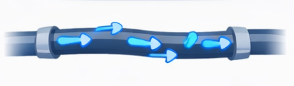
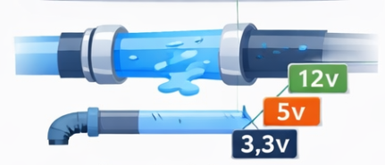
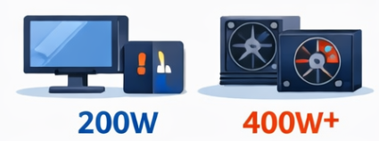
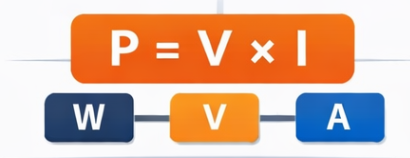
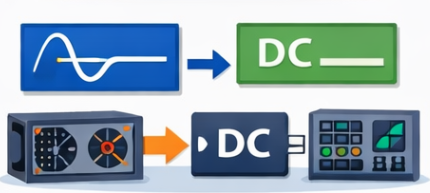
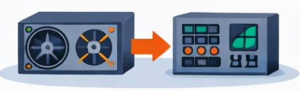

# 📘 **AULA 01 — FUNDAMENTOS DE ELETRICIDADE APLICADOS AO COMPUTADOR**

---

## 🔹 **1. Introdução e Contextualização**

Todo computador depende de energia elétrica para funcionar.
Sem energia adequada, ele pode:

* Não ligar
* Reiniciar sozinho
* Travar
* Sofrer danos permanentes

Por isso, antes de aprender a montar ou configurar um computador, é essencial entender:

> **Como a eletricidade funciona e como ela alimenta os componentes.**

Nesta aula, o objetivo é compreender os conceitos básicos que explicam o funcionamento elétrico de um computador.

---

## 🔹 **2. O que é Eletricidade**

A eletricidade pode ser entendida, de forma simplificada, como:

> **O movimento de elétrons através de um condutor (como um fio).**

Esse movimento transporta energia, que será utilizada pelos dispositivos eletrônicos.

No computador:

* Essa energia alimenta o processador, memória, armazenamento e demais componentes.

---

## 🔹 **3. Tensão Elétrica (Voltagem)**

A tensão elétrica representa a “força” que empurra os elétrons.

> **Definição:** diferença de potencial elétrico entre dois pontos.
> **Unidade:** Volt (V)

### 🔧 Exemplos práticos:

* Tomadas residenciais: **127V ou 220V**
* Fonte do computador:

  * 12V → componentes de maior consumo
  * 5V → circuitos intermediários
  * 3,3V → componentes sensíveis

### 💡 Interpretação:

A tensão é como a **pressão da água em um cano**.

---

## 🔹 **4. Corrente Elétrica**

A corrente elétrica representa o fluxo de elétrons.

> **Definição:** quantidade de elétrons que passa por um ponto do circuito.
> **Unidade:** Ampère (A)

### 💡 Interpretação:

Se a tensão é a pressão, a corrente é a **quantidade de água fluindo**.

### 🔧 Aplicação:

* Quanto maior o consumo de um componente, maior a corrente necessária.
* Processadores e placas de vídeo exigem mais corrente.

---

## 🔹 **5. Potência Elétrica**

A potência indica a quantidade de energia consumida ou fornecida.

> **Definição:** taxa de consumo de energia elétrica
> **Unidade:** Watt (W)

### 💡 Interpretação:

Potência = “quantidade total de energia sendo utilizada”

### 🔧 Exemplos:

* Computador simples: ~200W
* Computador com placa de vídeo: 400W ou mais

---

## 🔹 **6. Relação entre Tensão, Corrente e Potência**

Essas três grandezas estão diretamente relacionadas:

P = V \cdot I

Onde:

* **P** = potência (W)
* **V** = tensão (V)
* **I** = corrente (A)

### 🔧 Interpretação prática:

* Se um componente precisa de mais potência:

  * Ele pode exigir mais corrente
  * Ou operar em uma tensão específica

👉 Isso é essencial para entender **dimensionamento de fontes**.

---

## 🔹 **7. Tipos de Corrente Elétrica**

### ⚡ Corrente Alternada (AC)

* Utilizada na rede elétrica
* A energia muda de direção constantemente
* Exemplo: tomada da parede

### 🔋 Corrente Contínua (DC)

* Fluxo em uma única direção
* Utilizada por dispositivos eletrônicos

### 🔧 Aplicação no computador:

* A energia chega em **AC**
* O computador funciona em **DC**

---

## 🔹 **8. Conversão de Energia (Introdução à Fonte)**

A fonte de alimentação tem uma função essencial:

> **Converter corrente alternada (AC) em corrente contínua (DC).**

Além disso, ela:

* Reduz a tensão (de 127V/220V para valores menores)
* Distribui energia para os componentes

👉 Sem essa conversão, o computador não funcionaria corretamente.

---

## 🔹 **9. Segurança Elétrica Básica**

Trabalhar com eletricidade exige atenção.

### ⚠️ Riscos:

* Choque elétrico
* Queima de componentes
* Incêndio

### ✅ Boas práticas:

* Nunca abrir equipamentos energizados
* Utilizar cabos adequados
* Evitar fontes de baixa qualidade
* Desligar da tomada antes de manusear

---

## 🔹 **10. Aplicação Prática e Reflexão**

Considere as situações:

* Um computador que reinicia sozinho
* Um equipamento que não liga
* Uso de uma fonte genérica em um sistema mais exigente

### 🧠 Perguntas para reflexão:

* A fonte fornece energia suficiente?
* A tensão está correta?
* Há sobrecarga de corrente?

---

## 🎯 **Síntese da Aula**

Nesta aula, você aprendeu que:

* A eletricidade é essencial para o funcionamento do computador
* Tensão, corrente e potência são grandezas fundamentais
* Existe diferença entre corrente AC e DC
* A fonte de alimentação realiza a conversão e distribuição de energia
* Problemas elétricos podem causar falhas no sistema

