# Infraestrutura Física de Redes
## Curso Técnico Pós-Médio

---

# AULA 09 — Patch Panels e Canaletas

**Objetivo da aula:** Compreender a função e as especificações dos patch panels de cobre e fibra, conhecer os sistemas de canalização e proteção de cabos, e entender as boas práticas introdutórias de organização e identificação de infraestrutura de redes.

---

## 1. Patch Panel de Cobre

### O que é e Qual sua Função

O **patch panel** é o painel de conexões que centraliza as terminações de todos os cabos de instalação que chegam à sala de telecomunicações. É o ponto de encontro entre o cabeamento permanente (embutido nas paredes) e os equipamentos ativos (switches).

Sem o patch panel, cada cabo de instalação seria conectado diretamente ao switch — o que tornaria qualquer reorganização ou manutenção extremamente trabalhosa, além de expor os cabos de instalação a dobramento e desgaste repetidos.

Com o patch panel, o fluxo é:

O patch panel funciona como um organizador passivo — não processa dados, apenas termina e organiza os cabos, permitindo que qualquer porta seja conectada a qualquer switch através de um simples patch cord.

### Construção Física

O patch panel é composto por:

**Portas frontais RJ-45:** onde os patch cords são conectados, interligando o patch panel ao switch. Numeradas sequencialmente para facilitar a identificação.

**Conexões traseiras (keystone ou 110):** onde os fios do cabo de instalação são terminados por impacto (punch-down). Cada porta frontal corresponde a uma terminação traseira.

**Corpo metálico:** estrutura em aço que se fixa no rack através dos furos padrão nas laterais.

**Etiquetas de identificação:** campo para identificar cada porta — número do ponto de rede, localização da tomada correspondente.

### Categorias

Assim como cabos e conectores, os patch panels são fabricados em categorias:

| Categoria | Compatível com |
|---|---|
| Cat5e | Instalações legadas |
| Cat6 | Padrão atual — novas instalações |
| Cat6A | Instalações 10 Gbps em distância plena |

A categoria do patch panel deve ser compatível com todo o restante do canal de transmissão — cabo, conectores e tomadas.

### Tamanhos — Número de Portas

Patch panels são fabricados em tamanhos padronizados para rack 19":

| Tamanho | Altura | Uso típico |
|---|---|---|
| 12 portas | 1U | Instalações pequenas, salas individuais |
| 24 portas | 1U | Padrão para a maioria das instalações |
| 48 portas | 2U | Instalações de maior porte |

A escolha do tamanho deve considerar o número atual de pontos de rede e uma margem de crescimento — o ideal é não ocupar mais que 80% das portas disponíveis na instalação inicial.

### Patch Panel com Gestão de Cabos Integrada

Alguns modelos de patch panel possuem **organizadores de cabos integrados** — uma faixa com passadores de cabo fixada logo abaixo ou acima do painel. Facilita o roteamento dos patch cords que saem das portas frontais em direção ao switch, mantendo a organização sem necessidade de organizadores separados.

---

## 2. Patch Panel de Fibra

O patch panel de fibra cumpre a mesma função organizacional que o de cobre — centraliza as terminações dos cabos de fibra que chegam à sala de telecomunicações e permite a conexão flexível com os equipamentos ativos através de patch cords de fibra.

### Diferenças em Relação ao Patch Panel de Cobre

| | Patch Panel de Cobre | Patch Panel de Fibra |
|---|---|---|
| Conectores | RJ-45 | SC, LC (adaptadores) |
| Terminação traseira | Punch-down (110) | Fusão ou conector mecânico |
| Fragilidade | Baixa | Alta — fibra de vidro |
| Raio mínimo de curvatura | Maior tolerância | Deve ser respeitado rigorosamente |

### Tipos de Adaptadores

O patch panel de fibra recebe **adaptadores** — peças removíveis que definem o tipo de conector aceito. Os mais comuns são SC e LC, em versões simplex (uma fibra) e duplex (duas fibras).

A modularidade dos adaptadores permite que o mesmo patch panel seja reconfigurado para diferentes tipos de conector conforme a necessidade da instalação.

> A terminação prática de fibra óptica — fusão e conectorização mecânica — será abordada em profundidade na disciplina do próximo semestre.

---

## 3. Organização e Identificação de Cabos

### Por que a Identificação é Obrigatória

Uma instalação de rede sem identificação adequada é uma instalação problemática — não importa quão bem executada tecnicamente. Sem identificação:

- Localizar um cabo específico exige rastreamento físico ponta a ponta
- Manutenção e expansão se tornam lentas e arriscadas
- Qualquer intervenção pode desconectar o cabo errado
- A documentação perde valor se não corresponde à realidade física

Em instalações profissionais, a identificação não é opcional — é parte da entrega.

### Etiquetagem de Cabos, Portas e Patch Panels

**Cabos:** cada cabo deve ter etiqueta nas duas extremidades — na tomada e no patch panel. A etiqueta deve ser legível, durável e fixada de forma que não se solte com o tempo. Etiquetas autoadesivas específicas para cabos de rede são o padrão.

**Portas do patch panel:** cada porta deve ser identificada com o número do ponto de rede correspondente. A numeração deve ser sequencial e consistente com a planta de rede documentada.

**Equipamentos no rack:** cada equipamento deve ter etiqueta identificando nome, função e endereço IP de gerência quando aplicável.

### Cores de Patch Cords como Recurso de Organização

O uso de patch cords coloridos é uma prática simples e eficiente para organização visual. Ao adotar cores diferentes para diferentes funções — dados, uplinks, gerência, VoIP — qualquer pessoa consegue identificar rapidamente o propósito de cada conexão sem precisar ler etiquetas individualmente.

A convenção de cores deve ser **documentada** e mantida consistente em toda a instalação.

### Introdução à Documentação de Rede

A documentação é o registro formal da infraestrutura instalada. Uma documentação básica deve conter:

- **Planta de rede:** planta baixa do ambiente com a localização de cada ponto de rede numerado
- **Tabela de cabos:** lista de todos os cabos com número, origem (tomada) e destino (porta do patch panel)
- **Diagrama do rack:** representação visual da organização dos equipamentos no rack, com identificação de cada porta utilizada
- **Registro de equipamentos:** lista de switches, roteadores e demais equipamentos com endereços IP, modelo e localização

> A documentação será aprofundada na disciplina de Cabeamento e Infraestrutura de Redes no próximo semestre. Aqui o objetivo é compreender sua importância e os elementos que a compõem.

---

## 4. Canaletas

### O que São e Qual sua Função

**Canaletas** são perfis com tampa usados para organizar e proteger cabos que percorrem paredes, tetos ou pisos de forma aparente — sem necessidade de embutir na alvenaria.

Protegem os cabos de danos mecânicos, organizam o trajeto e permitem fácil acesso para manutenção ou ampliação — a tampa é removível sem ferramentas na maioria dos modelos.

### Materiais

**PVC:** o material mais comum. Leve, fácil de cortar e instalar, resistente à corrosão. Disponível em branco e cores variadas. Adequado para a maioria dos ambientes internos.

**Alumínio:** mais resistente mecanicamente. Usado em ambientes industriais, laboratórios e locais com maior risco de impacto físico ou temperaturas elevadas.

### Tamanhos e Capacidade de Cabos

Canaletas são fabricadas em diversas dimensões — largura × altura — que determinam quantos cabos cabem no seu interior:

| Dimensão | Capacidade aproximada | Uso típico |
|---|---|---|
| 20 × 12 mm | 2 a 4 cabos Cat6 | Pequenas instalações, residencial |
| 40 × 16 mm | 6 a 10 cabos Cat6 | Escritórios pequenos |
| 60 × 40 mm | 15 a 25 cabos Cat6 | Instalações corporativas |
| 100 × 60 mm | 40+ cabos Cat6 | Backbone, grandes instalações |

> A capacidade real depende do diâmetro dos cabos e da organização interna. O correto é não ultrapassar 60% da capacidade nominal da canaleta — deixando espaço para futuras expansões e garantindo que os cabos não sejam comprimidos.

### Tipos de Canaleta

**Canaleta de parede:** instalada horizontalmente ou verticalmente na parede. É o tipo mais comum em escritórios e instalações comerciais.

**Canaleta de piso:** instalada no rodapé ou embutida no piso. Usada quando o trajeto pela parede não é viável ou esteticamente adequado.

**Canaleta de rack:** instalada verticalmente nas laterais internas do rack, organizando os cabos que percorrem o comprimento do rack.

**Canaleta flexível (corrugada):** tubo corrugado flexível, usado para proteger cabos em trechos que exigem curvatura — passagens entre painéis, conexões móveis, proteção de cabos sob o piso elevado.

---

## 5. Eletrodutos

### Diferença entre Canaleta e Eletroduto

A canaleta é aberta e com tampa removível — voltada para organização e fácil acesso aos cabos. O **eletroduto** é um tubo fechado — voltado para proteção mecânica máxima e para passagens embutidas em paredes, lajes e pisos.

| | Canaleta | Eletroduto |
|---|---|---|
| Acesso aos cabos | Fácil — tampa removível | Difícil — cabo deve ser puxado |
| Proteção mecânica | Moderada | Alta |
| Instalação | Aparente | Embutida ou aparente |
| Adição de cabos | Simples | Exige puxamento |

### Tipos

**Eletroduto rígido de PVC:** o mais comum em instalações prediais. Fácil de cortar e conectar com luvas e curvas padronizadas. Usado em instalações embutidas em alvenaria e instalações aparentes em ambientes internos.

**Eletroduto flexível de PVC (corrugado):** permite curvatura livre. Usado em trechos curtos que exigem flexibilidade — saída de eletroduto rígido para equipamento, passagem por juntas de dilatação.

**Eletroduto metálico:** maior resistência mecânica e blindagem eletromagnética. Usado em ambientes industriais, externas e locais com risco de impacto físico severo.

### Separação Obrigatória entre Cabos de Dados e Cabos Elétricos

Cabos de rede e cabos de energia elétrica **nunca devem compartilhar o mesmo eletroduto ou canaleta**. Os campos eletromagnéticos gerados pelos cabos elétricos induzem ruído nos cabos de dados, degradando o desempenho da rede.

As normas técnicas (ABNT NBR 14565 e NR-10) estabelecem distâncias mínimas de separação entre cabos de dados e cabos elétricos — tema que será aprofundado na disciplina de Cabeamento e Infraestrutura de Redes e no bloco de Segurança do Trabalho.

---

## 6. Passa-Cabos e Abraçadeiras

### Passa-Cabos

**Passa-cabos de parede:** peças instaladas em aberturas de parede por onde os cabos passam de um ambiente para outro. Protegem o cabo no ponto de passagem — evitando atrito e danos na borda da abertura — e vedam a abertura após a passagem dos cabos.

**Passa-cabos de rack (organizador horizontal):** acessório instalado no rack, geralmente de 1U, com anéis ou passadores por onde os patch cords são roteados. Mantém os cabos organizados e no caminho correto entre o patch panel e o switch, evitando que fiquem soltos e embaraçados.

### Abraçadeiras

**Abraçadeiras de nylon (enforca-gato):** trava por catraca — aperta mas não afrouxa. Usadas para fixação definitiva de feixes de cabos em eletrodutos e canaletas. Não devem ser usadas para organizar patch cords dentro do rack — uma vez apertadas, não permitem ajuste sem cortar a abraçadeira.

**Abraçadeiras de velcro:** fecham e abrem por pressão, sem ferramentas. São a escolha correta para organizar patch cords dentro do rack e em qualquer ponto onde os cabos precisam ser reorganizados periodicamente. Não danificam os cabos e não restringem o raio de curvatura.

### Boas Práticas de Organização

**Raio mínimo de curvatura:** cada cabo tem um raio mínimo de curvatura que não deve ser ultrapassado — dobrar o cabo além desse limite comprime os pares internos, aumenta o crosstalk e pode danificar permanentemente o cabo. Para cabos Cat6, o raio mínimo é geralmente 4 vezes o diâmetro externo do cabo.

**Tensão excessiva:** cabos não devem ser esticados sob tensão — a tração mecânica altera as características elétricas do cabo, especialmente nos pontos de terminação. Sempre deixar uma folga adequada.

**Organização de feixes:** agrupar cabos de função similar em feixes organizados com abraçadeiras de velcro, roteados de forma limpa e sem cruzamentos desnecessários. Feixes bem organizados facilitam a identificação, a manutenção e futuras expansões.

---

## Síntese da Aula

O patch panel e os sistemas de canalização são os componentes que organizam e protegem a infraestrutura de rede entre os pontos de uso e os equipamentos ativos. Os principais pontos desta aula:

- O patch panel centraliza as terminações do cabeamento permanente e permite conexão flexível com os switches via patch cords
- A categoria do patch panel deve ser compatível com todo o canal de transmissão
- Identificação e documentação são parte obrigatória de qualquer instalação profissional
- Canaletas organizam cabos aparentes com fácil acesso; eletrodutos protegem cabos em instalações embutidas
- Cabos de dados e cabos elétricos nunca devem compartilhar o mesmo duto ou canaleta
- Abraçadeiras de velcro são a escolha correta para organização interna do rack